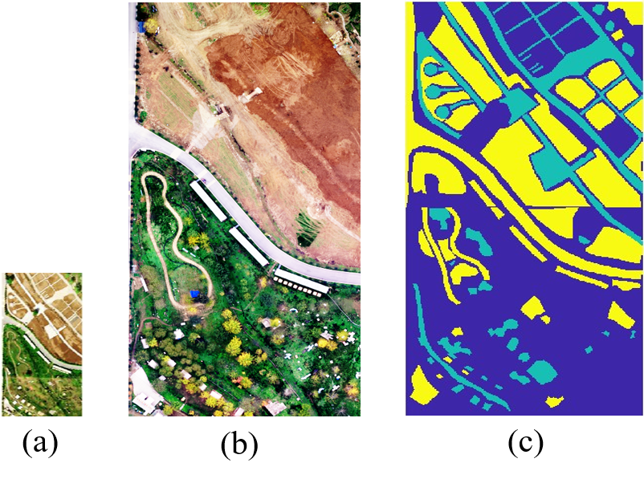

# CT2Net for HSI-RGB Multimodal Change Detection
The python code implementation of the paper "Cycle Translation-Based Collaborative Training for Hyperspectral-RGB Multimodal Change Detection"

# The Liyukou Dataset for HSI-RGB Multimodal CD
The dataset covers an area of Liyukou, Huyi, Xi’an, Shannxi Province, which contains an HSI taken on April 06, 2023 and a RGB image captured on November 18, 2022, as shown in Figs. (a) and (b), respectively. The RGB image was obtained by FILR DUO Rro R sensor and the HSI was captured by Micro-Hyperspec sensor. The dataset encompasses diverse scenes,including trees, roads, soil, and buildings, showcasing the dynamic changes of various ground objects such as farmlands and land covers. The ground-truth map is depicted in Fig. (c).

# Requirements

- Ubuntu 20.04   cuda 11.0
- Python 3.7  Pytorch 1.7
